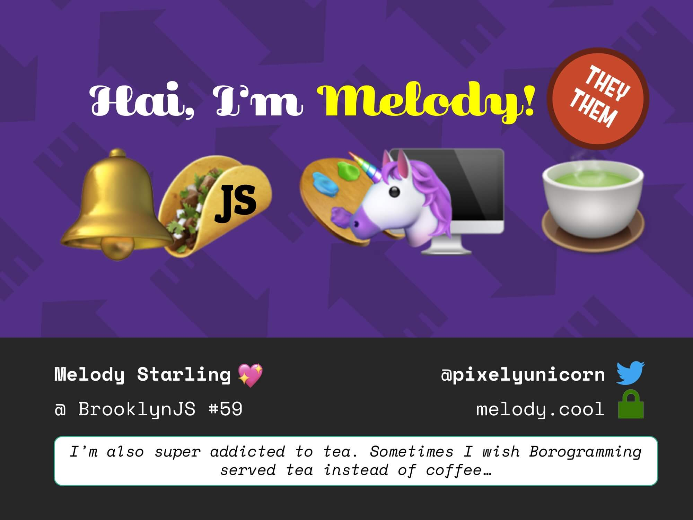

# Spook your friends with Electron! :ghost:

This file contains a compressed version of the slides with text content, alt text, and captions.

You can find higher quality images of the slides and a downloadable PDF at: https://speakerdeck.com/pixely/spooking-your-friends-with-electron-brooklynjs-number-59.

Follow Melody on Twitter: https://twitter.com/pixelyunicorn

## Slide 1


Spook your friends with Electron!

w/ Melody Spookling

@pixelyunicorn

Alt text: Ghost emoji.

> (I love you front row!)

## Slide 2


> In case you were wondering what my profile picture was about, I helped a team of student coders build a cyborg alpaca using Arduino and Node.js!

## Slide 3


Hi, I'm Melody! (they/them)

Alt text: Bell emoji.

> Hi, I’m Melody. My pronouns are they/them. I’m from the sometimes sunny city of Philadelphia.

## Slide 4


Hi, I'm Melody! (they/them)

Alt text: Taco emoji with the letters JS on top of it.

> I started TacoJS. It’s like BrooklynJS but with tacos. We haven’t had a meetup recently, so if you want to speak feel free to send us a pull request! (tacojs.github.io)

## Slide 5


Hi, I'm Melody! (they/them)

Alt text: Color pallete and desktop computer emojis.

> I also specialize in design and web development.

## Side 6


Hi, I'm Melody! (they/them)

Alt text: Unicorn emoji.

> I guess that makes me a unicorn!

## Slide 7



Hi, I'm Melody! (they/them)

Alt text: Tea emoji.

> I’m also super addicted to tea. Sometimes I wish Borogramming served tea instead of coffee…

## Slide 8


I'm looking for a job!

https://melody.cool

> Oh, and I’m looking for a job! If you’re hiring, please check out my website at melody.cool!

## Slide 9


What is Electron?

Alt text: An Electron logo, consisting of electrons revolving in an atom. Below it is the GitHub Octocat, which is a black cat with 8 octopus legs and a light-skinned face.

> So what is Electron? Well, it’s a framework created by GitHub…

## Slide 10


What is Electron?

Alt text: Crane and desktop window emojis.

> …that allows you to build cross-platform desktop applications…

## Slide 11


What is Electron?

Alt text: Javascript logo, consisting of the letters JS at the bottom right corner of a yellow square.

> …using Javascript! And HTML! And CSS!

## Slide 12


Alt text: Logos of applications using Electron, including Skype, Discord, Slack, and GitHub.

> Chances are, if you use desktops apps like Skype, Discord, Slack, or GitHub, you probably already use Elecrtron!

## Slide 13


Let’s build an Electron app!

> So let’s build an Electron app!

## Slide 14


Let’s build an Electron app!

https://github.com/electron/electron-quick-start

> Now, no one likes to start from scratch, so I used this code as my starting point.

## Slide 15


Let’s build an Electron app!

`npm install electron`

> All you need to do is run npm install electron. (Speaking of npm, its co-founder is sitting right in front of me. Hi, Laurie!)

## Slide 16


````js
const electron = require('electron')
const { app, BrowserWindow } = require('electron')
````

> Then you require the Electron module.

## Slide 17


````js
function createWindow () {
    // Create the browser window.
    win = new BrowserWindow({ width: 800, height: 600 })

    // and load the index.html of the app.
    win.loadFile('boo.html')

    // Emitted when the window is closed.
    win.on('closed', () => {
        // Dereference the window object, usually you would store windows
        // in an array if your app supports multi windows, this is the time
        // when you should delete the corresponding element.
        win = null
    })
}
````

> And this function, at less than 10 lines of code without comments, is all it takes to create a basic Electron app.

## Slide 18


````js
win = new BrowserWindow({ width: 800, height: 600 })
win.loadFile('boo.html')
````

> So what we’re doing here is creating a new BrowserWindow instance with a width of 800 and a height of 600. Then we’re loading an HTML page called boo.html. That’s it.

## Slide 19


Demo time!

Alt text: Window with titlebar that says "Hello Word!", containing a header tag that also says "Hello World!"

> Here’s what that looks like! (Window resized to fit slide.)

## Slide 20


````js
win = new BrowserWindow({ width: 800, height: 600 })
````

> Now, here’s where the evil comes in. You can add some pretty scary parameters into BrowserWindow…

## Slide 21


````js
win = new BrowserWindow({
    width: 800,
    height: 600,
    frame: false,
    transparent: true,
    toolbar: false,
    simpleFullscreen: true
})
````

> …Like hiding the window frame, having a transparent background, hiding the title bar, and a full screen mode that doesn’t open in another workspace on macOS.

## Slide 22


````js
// Ignore mouse events
win.setIgnoreMouseEvents(true)

// Hide dock icon
app.dock.hide();

// Set always on top
win.setAlwaysOnTop(true, "floating");
win.setVisibleOnAllWorkspaces(true);
win.setFullScreenable(false);
win.setFullScreen(true)
````

> We can go even further! Let’s have clicks pass through it, hide the icon from the dock so no one knows it’s running, and set it so that it’s always on top and full-screen by default!

## Slide 23


Demo time!

Alt text: A header tag that says "Hello World!" overlaid transparently directly on top of another window.

> Here’s what that looks like! Notice how you can click through it, and how it persists on top of macOS spaces, like this full-screen window. This brings us some interesting use cases…

## Slide 24


Use Case #1:

````html
<!DOCTYPE html>
<html lang="en">
<head></head>
<body>
    <audio autoloop loop style="display: none">
        <source src="horse.mp3" type="audio/mpeg">
    </audio>
</body>
</html>
````

> The first of which is playing horse noises in the background. This is literally all the code it takes.

## Slide 25


Use Case #1:

````html
<audio autoloop loop style="display: none">
    <source src="horse.mp3" type="audio/mpeg">
</audio>
````

> It autoplays a file called horse.mp3 on loop, hidden on plain sight!

## Slide 26


Demo time!

Alt text: A bunch of horses saying "neigh"

> (Because I can’t embed sound into uploaded slideshows, imagine hearing a bunch of horses going neigh and not knowing where it’s coming from!)

## Slide 27


Use Case #2:

Alt text: A watermark at the bottom-right corner of the screen that says "Activate Windows. Go to Settings to activate windows." on the Windows operating system.

> Has anyone here ever pirate Windows? Well, if you do, you may end up with this beautiful Activate Windows watermark. But what if you did pay for Windows? Or use macOS? Or even Linux?

## Slide 28


Demo time!

Alt text: A watermark at the bottom-right corner of the screen that says "Activate Windows. Go to Settings to activate windows." on the macOS operating system.

> You’re not missing out on anything, thanks to Electron!

## Slide 29


Use Case #3:

Alt text: A ransomware window demanding a Bitcoin payment

> Of course, if you truly want to do evil, you can probably create Ransomware with Electron. Not that you should.

## Slide 30


Let's go all out!

> But that just scratches the surface of the harmless (and not-so-harmless) pranks we can pull on people. Let’s take this even further!

## Slide 31


Cracked Screen

Alt text: an image of a cracked screen.

> Here’s a jpeg of a cracked screen I found on the internet. You probably know where I’m going with this.

## Slide 32


Cracked Screen

Alt text: an image of a cracked screen, but with a transparent background.

> I can’t afford Photoshop, so I’ll use PowerPoint as my image editor. It has a built-in Remove Background feature that will give me a nice transparent image to work with.

## Slide 33


> Let’s just add that image to my CSS and have it cover the whole page…

## Slide 34


Alt text: an image of a cracked screen, but with a transparent background, overlaid on top of a desktop.

> And look at that! (Sorry for breaking your projector, I’ll unbreak it in just a second!)

## Slide 35


Limitations (macOS)

Cannot (yet) draw over cursor, launchpad, mission control, login screen, etc

> Of course, it’s super obvious that it’s a prank because of Electron’s limitations, especially since it can’t draw over the cursor or menu bar…

## Slide 36


Glitch Effect

https://tympanus.net/Tutorials/CSSGlitchEffect/

> Let’s build something that’s a bit more subtle, like a glitching screen. Here’s one I found on the internet.

## Slide 37


Glitch Effect

Alt text: A browser window featuring a glitching background image

> Since Electron is powered by the same technology as web pages, we can bring this image glitch effect to the desktop!

## Slide 38


Glitch Effect

https://electronjs.org/docs/api/desktop-capturer

Alt text: A borwser window showing documentation for desktopCapturer in Electron's API

> How this particular glitch effect works, is that it takes a background image and flickers multiple crops of it across the screen. Here’s something I found that will allow us to use a screenshot of the desktop as our background image.

## Slide 39


Demo time!

Alt text: A terminal window.

> Here’s a demo of how that works. Here’s a terminal window.

## Slide 40


Demo time!

Alt text: A terminal window, with small sections of the windows tinted and shifted around.

> Here’s that same terminal window, with the glitch applied. Notice how we are shifting and adding random tints everywhere.

## Slide 41


Demo time!

Alt text: A terminal window, extremely disorted, completely tinted and shifted around.

> If you’re feeling woke, you can also have the glitch run recursively! This may result in a memory leak crashing your computer at some point. (This actually did crash my computer!)

## Slide 42


Thank You! ~

Alt text: Sparkle emoji.

Hire me:  https://melody.cool

Tweet me: https://twitter.com/pixelyunicorn

Splat me: SW-4207-5422-1528

Patreon:  https://patreon.com/madebymelody

> Thank you so much for coming out to see my BrooklynJS talk! Here’s where you can find me if you want to keep in touch.
